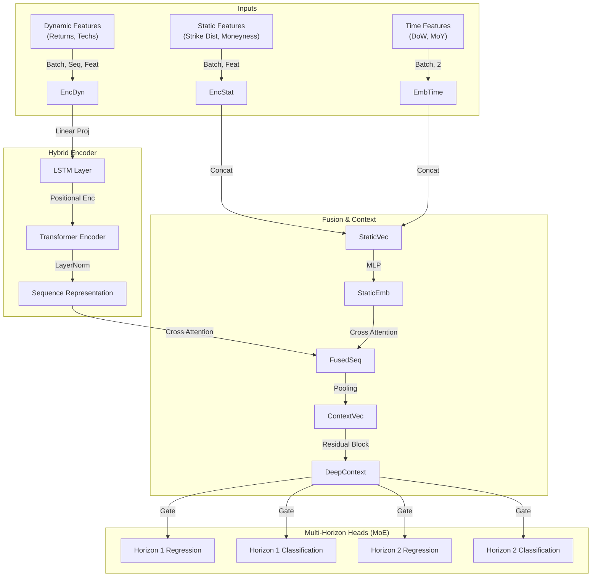
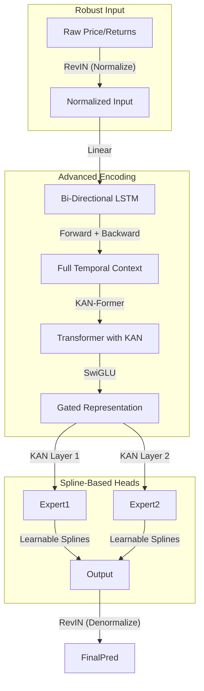
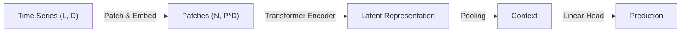

# 🧠 Model Trading Training Library

A unified deep learning framework for financial time-series forecasting, specializing in regression and classification of asset returns. This library consolidates state-of-the-art architectures (Transfomers, Bi-LSTMs, Mixture-of-Experts) with robust financial engineering.

## ⚙️ Data Engineering (New)

The library now features a **GenericProcessor** driven by JSON configuration, replacing hardcoded feature logic. This allows for rapid experimentation with features like:

*   **Financial**: Greeks, RSI, MACD, Bollinger Bands, ATR.
*   **Signal Processing**: Fourier Transform (Spectral Entropy), Wavelet Transform (Ricker).
*   **Regime Detection**: Gaussian Mixture Models (GMM) for volatility state classification.

## 🏗️ Architecture Overview

The library supports three primary model families: **Universal Hybrid** (Standard), **V17 Experimental** (Cutting Edge), and **PatchTST** (Long-Horizon).

### 1. Hybrid Joint Network (Universal Standard)
Combines the strengths of **LSTMs** (sequential local patterns) and **Transformers** (global attention) with a **Mixture-of-Experts (MoE)** head.



### 2. V17 Experimental (Cutting Edge)
Enhances the standard model with **RevIN** for stationarity, **Bi-Directional LSTMs** for full context, and **Kolmogorov-Arnold Networks (KAN)** for learnable activation functions.



### 3. PatchTST (Long-Horizon Forecasting)
State-of-the-art Transformer that treats **time-series patches** as tokens. This significantly reduces computation while capturing local semantic information better than point-wise attention.



---

## 📐 Mathematical Formulations

### Reversible Instance Normalization (RevIN)
To handle **distribution shift** (non-stationarity) in financial data, RevIN normalizes the input instance-wise and (optionally) denormalizes the output.

$$
\hat{x}_{t} = \gamma \frac{x_{t} - \mu_{t}}{\sigma_{t} + \epsilon} + \beta
$$

where $\mu_{t}$ and $\sigma_{t}$ are the mean and standard deviation of the *input sequence* at time $t$. This allows the model to learn localized patterns independent of the absolute price level.

### Kolmogorov-Arnold Networks (KAN)
Unlike MLPs which use fixed activation functions (ReLU, GELU) on nodes, KANs place learnable **B-Spline** activation functions on the *edges* (weights).

$$
\phi(x) = w_b \cdot b(x) + w_s \cdot \sum_{i=0}^{k} c_i B_i(x)
$$

where $b(x)$ is the base activation (SiLU), $B_i(x)$ are B-spline basis functions, and $c_i$ are learnable coefficients. This allows the network to learn the *shape* of the activation function itself, often leading to better regression performance with fewer parameters.

### Focal Loss
To handle the class imbalance between Bull/Bear/Neutral markets:

$$
FL(p_t) = -\alpha (1 - p_t)^\gamma \log(p_t)
$$

*   $\alpha$: Weight factor for the class (we weight **Bear** markets higher).
*   $\gamma$ (Gamma): Focusing parameter (usually 2.0). Down-weights easy examples (Neutral days) to focus learning on hard examples (Crashes/Rallies).

### Quantile Regression (Probabilistic)
To predict prediction intervals (e.g., 10th and 90th percentiles), we use the **Pinball Loss**:

$$
L_{\tau}(y, \hat{y}) = \max(\tau(y - \hat{y}), (\tau - 1)(y - \hat{y}))
$$

where $\tau$ is the target quantile (e.g., 0.1, 0.5, 0.9). The model outputs multiple predictions per time step, corresponding to these quantiles.

### Advanced Loss Functions
*   **Huber Loss**: Robust regression loss that transitions from MSE to MAE for errors larger than $\delta$, reducing sensitivity to outliers.
*   **Directional Loss**: Adds a penalty when the predicted sign disagrees with the target sign:

$$
L = (1 - \lambda) MSE + \lambda \cdot \text{mean}(|y - \hat{y}| \cdot \mathbb{I}_{\text{sign}(y) \neq \text{sign}(\hat{y})})
$$

---

## 🛠️ Project Structure

```text
Model_trading_training/
├── library/                   # The Engine
│   ├── network_architectures.py # HybridJointNetwork, ExperimentalNetwork
│   ├── processors.py          # Data Engineering (V11/V13/V15)
│   ├── advanced_components.py # KAN, RevIN, SwiGLU
│   ├── trainer.py             # Training Loop & Logging
│   └── factory.py             # Model Instantiation Logic
├── weights/                   # The Vault (Trained .pth files)
│   ├── bull_sniper_v13/
│   ├── bear_headhunter_v11/
│   └── ...
├── configs/                   # The Instructions
│   ├── zoo/                   # Reproducible configs for Weight/ models
│   └── templates/             # Starter configs for new experiments
└── tools/                     # The Actions
    ├── train.py               # CLI for training
    └── evaluate.py            # CLI for evaluation
```

## 🚀 Usage

**Train a V17 model:**
```bash
python -m Model_trading_training.tools.train --config configs/templates/experimental_v17.json
```

**Train a PatchTST model (Long-Term):**
```bash
python -m Model_trading_training.tools.train --config configs/templates/patchtst_config.json
```

**Evaluate an existing model:**
```bash
python -m Model_trading_training.tools.evaluate --config configs/zoo/bull_sniper_v13.json --weights weights/bull_sniper_v13/model.pth
```
